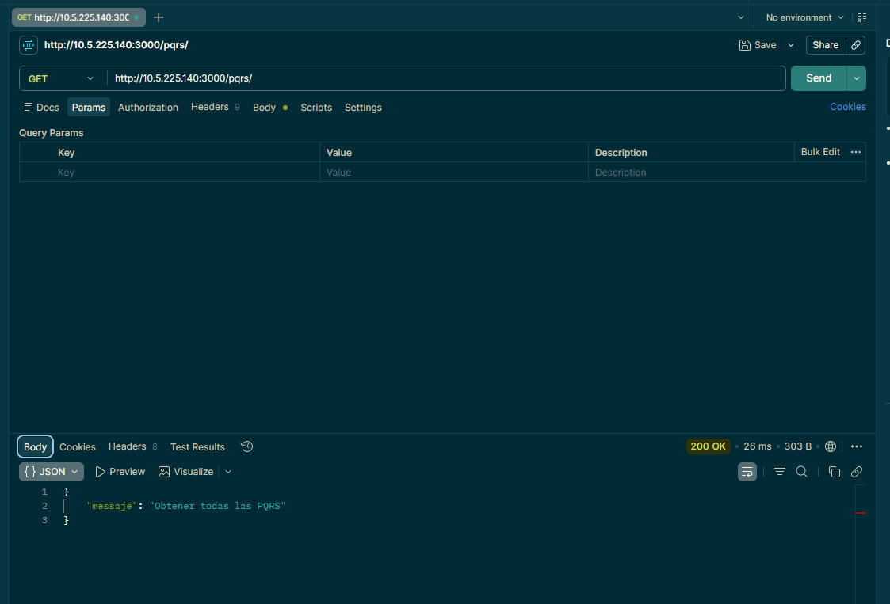
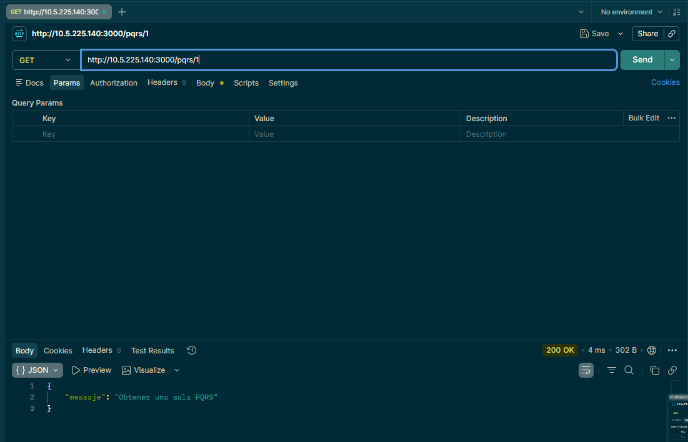
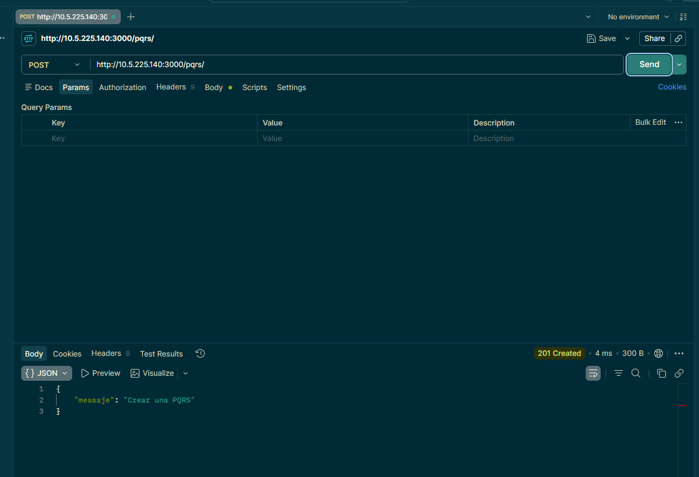
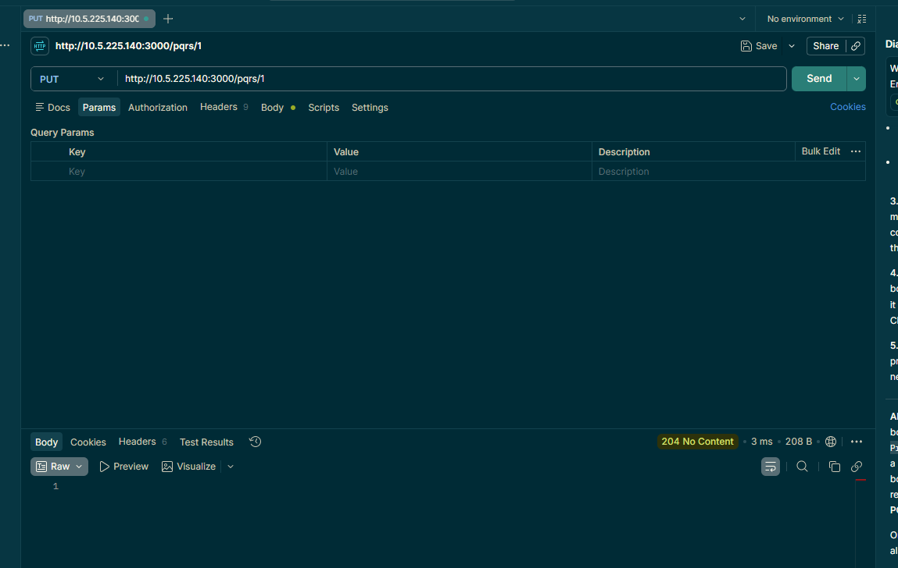
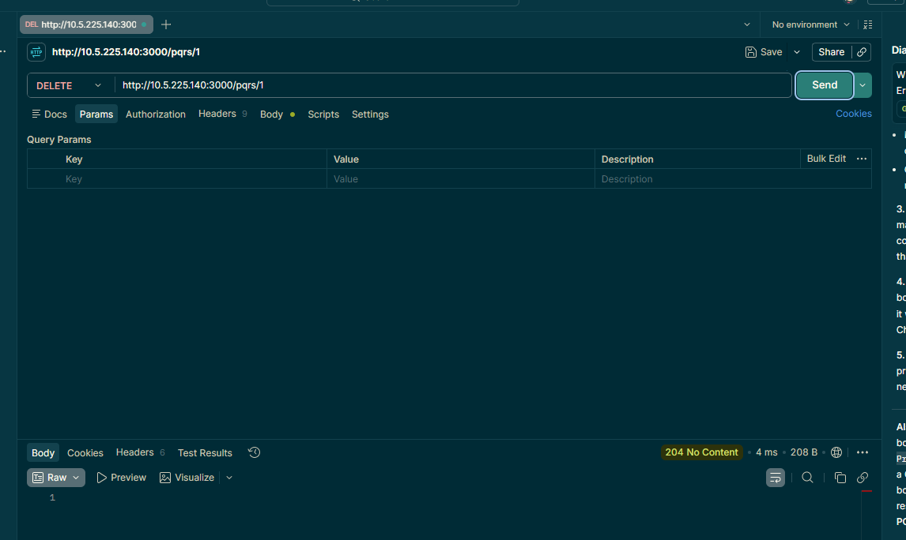

# ruta-modelo-controlador

# Actividad 1

Ordena correctamente el flujo de una petición desde que el cliente hace la solicitud hasta
que recibe la respuesta.

Elementos para ordenar:

• Controlador
• Cliente
• Base de datos
• Modelo
• Ruta

## orden 

1. Cliente
2. Ruta
3. Controlador
4. Modelo
5. Base de datos

# Actividad 2

Responde brevemente:

• ¿Qué componente se encarga de recibir la petición HTTP y dirigirla al controlador?  
El router, el es quien contiene el enpoint y redirecciona la request al controlador

• ¿Qué componente se encarga de comunicarse con la base de datos?
El modelo es quien sabe como hablar con la base de datos para hacer la accion que solicita un usuario

• ¿Qué componente envía finalmente la respuesta HTTP al cliente?
El controlador, en el esta ubicada la logia de la peticion y cuando recibe la respuesta del modelo, ya sea exitosa o fallida, envia el resultado al cliente en su metodo `res.json({})`

# Actividad 3

Relaciona el tipo de petición con su código de respuesta HTTP:

| Petición | Código esperado |
| :--- | :--- |
| GET | `200 OK` |
| POST | `201 Created` |
| DELETE | `204 No Content` |
| PUT | `204 No Content` |

